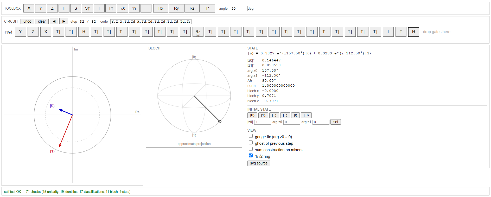

<p align="center">
  
</p>

<h1 align="left">
  Qorq
  <a href="https://qorq-qc.streamlit.app/" style="font-size: 0.5em; vertical-align: middle;">[live]</a>
</h1>

A drag-and-drop tool for exploring how single-qubit quantum gates transform a
complex statevector, drawn as phasors from a shared origin on an Argand plane.

There's no installing, configuring, or scripting required: just go to https://qorq-qc.streamlit.app, drag gates, and the output displays update in real time.

Quantum mechanics is formulated over complex Hilbert spaces. Yet many of our common visual and pedagogical tools translate quantum states into real-valued representations, emphasizing geometry or probabilities over the complex amplitudes themselves.

This project was created out of curiosity for visualizing quantum states in their native complex representation. Qorq draws the two complex amplitudes for a single qubit as phasors with a shared origin on an Argand plane, with a Bloch sphere displayed alongside it so the two representations can be compared directly for additional intuition.

## User Interface

<p align="center">
  
</p>

<p align="center">
  Qorq UI: Inspired by Quirk.
</p>

## Classifying single-qubit gates by what they do to phasors

Single-qubit gates transform the amplitudes:

$$
(z_0,z_1)\rightarrow(z_0',z_1')
$$

They can be grouped by the structure of the transformation applied to the two complex amplitudes.

<blockquote>
<p>
<b>Mathematical connection:</b><br>
These categories below correspond to a standard decomposition of unitary matrices:
<b>movers</b> are permutation matrices, <b>rotators</b> are diagonal unitaries,
<b>hybrids</b> are the general monomial case (permutation × diagonal),
and <b>mixers</b> are everything else. The visual names are used here because
that's how they behave visually as phasors in Qorq.
</p>
</blockquote>


| Behaviour | Description | Example |
|---|---|---|
| Identity | Leaves amplitudes unchanged | $I:(z_0,z_1)\rightarrow(z_0,z_1)$ |
| Mover | Relocates amplitudes without altering their values | $X:(z_0,z_1)\rightarrow(z_1,z_0)$ |
| Rotator | Changes phases without changing magnitudes | $Z:(z_0,z_1)\rightarrow(z_0,-z_1)$ |
| Mixer | Combines amplitudes through linear combinations | $H:(z_0,z_1)\rightarrow(\frac{z_0+z_1}{\sqrt2},\frac{z_0-z_1}{\sqrt2})$ |
| Hybrid | Combines multiple behaviours | $Y:(z_0,z_1)\rightarrow(-iz_1,iz_0)$ |

The tool classifies gates from their matrix structure. Global phase is ignored during classification.

> **Important:** For a single qubit, these categories describe the complete structure of the transformation: every gate either leaves amplitudes unchanged, moves them, changes their phases, combines them, or combines multiple behaviours. The specific matrix determines the exact transformation.
>
> Things become interesting with more qubits. The categories still apply: `CNOT` is a mover, `CZ` a rotator, $\sqrt{\text{SWAP}}$ a mixer, but the behaviour alone no longer determines the exact transformation. A gate acts on $2^n$ amplitudes, and which ones it touches depends on where it sits: which qubits it's applied to, which plays control and which target, and how many qubits are in the register.

## The gate toolbox, classified
 
| Gate | Category | Action on $(z_0, z_1)$ |
|---|---|---|
| **I** | identity | unchanged |
| **X** | mover | $(z_1,\ z_0)$ |
| **Y** | mover + rotator | $(-i z_1,\ i z_0)$ |
| **Z** | rotator | $(z_0,\ -z_1)$ |
| **S** | rotator | $(z_0,\ i z_1)$ |
| **S†** | rotator | $(z_0,\ -i z_1)$ |
| **T** | rotator | $(z_0,\ e^{i\pi/4} z_1)$ |
| **T†** | rotator | $(z_0,\ e^{-i\pi/4} z_1)$ |
| **P(φ)** | rotator | $(z_0,\ e^{i\varphi} z_1)$ |
| **Rz(θ)** | rotator | $(e^{-i\theta/2} z_0,\ e^{i\theta/2} z_1)$ |
| **H** | mixer | $\left(\frac{z_0+z_1}{\sqrt2},\ \frac{z_0-z_1}{\sqrt2}\right)$ |
| **√X** | mixer | $\frac12\left((1{+}i)z_0 + (1{-}i)z_1,\ (1{-}i)z_0 + (1{+}i)z_1\right)$ |
| **√Y** | mixer | $\frac12\left((1{+}i)z_0 - (1{+}i)z_1,\ (1{+}i)z_0 + (1{+}i)z_1\right)$ |
| **Rx(θ)** | mixer | $\left(\cos\tfrac\theta2 z_0 - i\sin\tfrac\theta2 z_1,\ -i\sin\tfrac\theta2 z_0 + \cos\tfrac\theta2 z_1\right)$ |
| **Ry(θ)** | mixer | $\left(\cos\tfrac\theta2 z_0 - \sin\tfrac\theta2 z_1,\ \sin\tfrac\theta2 z_0 + \cos\tfrac\theta2 z_1\right)$ |
 
- Boundary cases worth knowing: $R_x(0) = R_y(0) = R_z(0) = P(0) = I$ exactly. $R_x(180°)$ is a pure mover. $R_y(180°)$ is a mover and a rotator.


## Running it Locally

```bash
pip install -r requirements.txt
streamlit run app.py
```

## License

MIT.

## Acknowledgements

Interaction model and the Bloch depth-cue technique borrowed from [Quirk](https://algassert.com/quirk).
