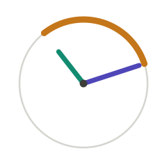

<p align="center">
  
  <h1 align="left">Qorq</h1>
</p>

A drag-and-drop tool for exploring how single-qubit quantum gates transform complex statevectors visualized as arrows sharing origin on an Argand plane. 

Quantum mechanics is fundamentally formulated over complex Hilbert spaces. Yet many of our most common visual and pedagogical tools translate quantum states into real-valued representations, emphasizing geometry or probabilities over the complex amplitudes themselves.

This project was created with the curiosity for a visualization in the complex hilbert space itself. The Bloch sphere is also displayed for comparison in the tool.

## Running it Locally

```bash
pip install -r requirements.txt
streamlit run app.py
```

## License

MIT.

## Acknowledgements

Interaction model and the Bloch depth-cue technique borrowed from [Quirk](https://algassert.com/quirk).
